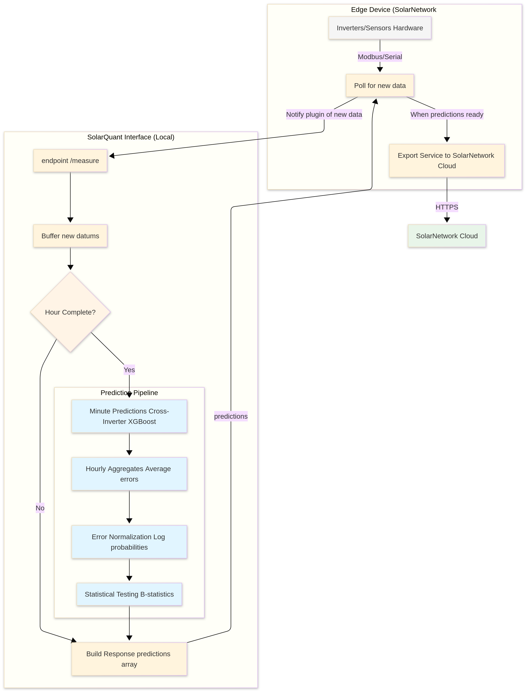

# SolarQuant Plugin

## How it works

The schema file in this repository gives a template that you can use to
generate an HTTP server in your chosen programming language. It defines how
SolarQuant will communicate with your server: what type of data it will be
sent, and what type of data it is expected to send back.

Steps to create a SolarQuant plugin:

1. Generate an HTTP server using the provided `schema.yaml` file. This can be
in whatever language/framework you like. You're free to use any libraries and
software that you need.

2. Create a Dockerfile that builds and runs your HTTP server. It should bundle
any dependencies and software that you need to make sure your HTTP server is
able to perform inference correctly.

3. Build the docker image and push it to a docker repository.

4. On a SolarNode, install the SolarQuant plugin. In the settings, configure
the docker image URL to point to your uploaded image.

The SolarNode will automatically fetch any new versions of your image. You can
make changes locally, build a new version of the image and push it up,
automatically changing your plugin version running on the node.

## Architecture



SolarQuant plugins use a polling interface. When new datums are generated on
the node, they are sent to your plugin using the `/measure` endpoint. Your
plugin is free to store the datums for later or use them now to make
predictions.

If your plugin has any prediction datums ready, it should return them in the
response to `/measure`. These datums that are returned will then be posted to
SolarNetwork for you.

## Endpoints

### `/health`

The `health` endpoint is called by SolarQuant at regular intervals to make
sure that your plugin is still functioning correctly. If it doesn't get a
healthy response in a timely fashion your plugin will be stopped and restarted.

**Response format:**
```json
{
  "status": "healthy",
  "timestamp": 1672531200,
  "uptime": 86400,
  "details": { .. }
}
```

### `/measure`

The request body contains an array of new datums that have been measured:

```json
{
  "datums": [
    {
      "nodeId": 377,              // This node
      "sourceId": "/INV/1",       // Which device? (inverter 1)
      "timestamp": 1672531200,    // When was this measured?
      "i": {                      // Instantaneous values
        "watts": 2450.5,
        "voltage": 240.2
      },
      "a": {                      // Accumulating values
        "wattHours": 8234
      },
      "s": {                      // Status values
        "phase": "A"
      }
    }
  ]
}
```

When your service accepts the measurements, it should acknowledge them and can include any predictions it generated:

```json
{
  "accepted": 1,
  "rejected": 0,
  "predictions": [
    {
      "nodeId": 377,
      "sourceId": "/INV/1",
      "timestamp": 1672531200,
      "i": {
        "watts": 2435.2          // Your predicted value
      },
      "s": {
        "anomalyStatus": "NORMAL"
      },
      "meta": {                  // Your plugin's extra info
        "confidence": 0.95
      }
    }
  ],
  "message": "processed"
}
```

Each item in `predictions` follows the schema defined in `schema.yaml`, and you're free to include any plugin-specific fields inside `meta`. If no predictions are ready, return an empty array or omit the field.


