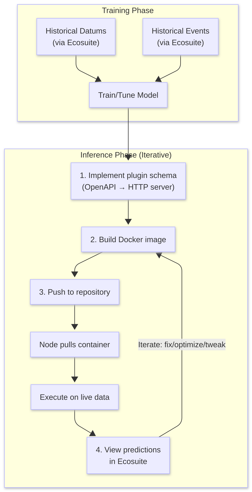

# SolarQuant Plugin

## How it works

The schema file in this repository gives a template that you can use to
generate an HTTP server in your chosen programming language. It defines how
SolarQuant will communicate with your server: what type of data it will be
sent, and what type of data it is expected to send back.

Steps to create a SolarQuant plugin:

1. Generate an HTTP server using the provided `schema.yaml` file. This can be
in whatever language/framework you like. You're free to use any libraries and
software that you need.

2. Create a Dockerfile that builds and runs your HTTP server. It should bundle
any dependencies and software that you need to make sure your HTTP server is
able to perform inference correctly.

3. Build the docker image and push it to a docker repository.

4. On a SolarNode, install the SolarQuant plugin. In the settings, configure
the docker image URL to point to your uploaded image.

The SolarNode will automatically fetch any new versions of your image. You can
make changes locally, build a new version of the image and push it up,
automatically changing your plugin version running on the node.

## Architecture


SolarQuant plugins use a polling interface. When new datums are generated on
the node, they are sent to your plugin using the `/measure` endpoint. Your
plugin is free to store the datums for later or use them now to make
predictions.

If your plugin has any prediction datums ready, it should return them in the
response to `/measure`. These datums that are returned will then be posted to
[SolarNetwork](https://github.com/SolarNetwork/solarnetwork-node-solarquant) for you.

## Endpoints

### `/health`

The `health` endpoint is called by SolarQuant at regular intervals to make
sure that your plugin is still functioning correctly. If it doesn't get a
healthy response in a timely fashion your plugin will be stopped and restarted.

**Response format:**
```json
{
  "status": "healthy",
  "timestamp": 1672531200,
  "uptime": 86400,
  "details": { .. }
}
```

### `/measure`

The request body contains an array of new datums that have been measured:

```json
{
  "datums": [
    {
      "nodeId": 377,              // This node
      "sourceId": "/INV/1",       // Which device? (inverter 1)
      "timestamp": 1672531200,    // When was this measured?
      "i": {                      // Instantaneous values
        "watts": 2450.5,
        "voltage": 240.2
      },
      "a": {                      // Accumulating values
        "wattHours": 8234
      },
      "s": {                      // Status values
        "phase": "A"
      }
    }
  ]
}
```

When your service accepts the measurements, it should acknowledge them and can include any predictions it generated:

```json
{
  "accepted": 1,
  "rejected": 0,
  "predictions": [
    {
      "nodeId": 377,
      "sourceId": "/INV/1",
      "timestamp": 1672531200,
      "i": {
        "watts": 2435.2          // Your predicted value
      },
      "s": {
        "anomalyStatus": "NORMAL"
      },
      "meta": {                  // Your plugin's extra info
        "confidence": 0.95
      }
    }
  ],
  "message": "processed"
}
```

Each item in `predictions` follows the schema defined in `schema.yaml`, and you're free to include any plugin-specific fields inside `meta`. If no predictions are ready, return an empty array or omit the field.

## Developer Workflow

The SolarNode is responsible for reading data from the devices that it's connected to. It exposes these devices as source IDs, each with measurements
like watts, voltage, frequency, etc. These are structured as datums:

```
{
  "created": "2025-12-11 22:44:27.437Z",
  "sourceId": "/G4/MA/S1/INV/1",
  "nodeId": 377,

  "localDate": "2025-12-11",
  "localTime": "17:44",
  "watts": 0,
  "current": 0,
  "dcPower": 0,
  "voltage": 493.4,
  "dcPower1": 0,
  "dcPower2": 0,
  "dcVoltage": 266.84998,
  "frequency": 60,
  "dcVoltage1": 266.9,
  "dcVoltage2": 266.8,
  "temp": 32.5,
  "dcCurrent": 0,
  "dcCurrent1": 0,
  "dcCurrent2": 0,
  "powerFactor": 0,
  "apparentPower": 0,
  "temp_heatSink": 23.6,
  "current_a": 0,
  "current_b": 0,
  "current_c": 0,
  "voltage_ab": 494.3,
  "voltage_bc": 491.6,
  "voltage_ca": 494.3,
  "wattHours": 32455000,
  "opStates": "8192",
  "opState": "3"
}
```

The data available is rich in information that may be useful for making future predictions or gaining new insights. To develop, test, and deploy a model, it's
best to think of two stages: *training* and *inference*.

Training is about taking a large dataset and tuning a model that is capable of being executed to classify or predict, while inference is the execution of the model
on novel data.

### Training

SolarQuant, using Ecosuite, is capable of downloading large streams of historical datums as well as historical events such as device failures. Together these form
a rich dataset that explains the minute level state of the devices as well as any failures or downtime.

For instance, downloading a month's worth of inverter data in an example format is as simple as:

```bash
$ sqc datums stream -s /MA/**/INV/* -f timestamp,watts,current,voltage --start 2022-05-01 --end 2022-06-01 -o datums.csv
$ head datums.csv
sourceId,objectId,timestamp,watts,current,voltage
/MA/PA/S1/INV/12,409,1651363240003,0,0,277.86667
/MA/PA/S1/INV/12,409,1651363300003,0,0,278.46667
/MA/PA/S1/INV/12,409,1651363360003,0,0,278.03333
/MA/PA/S1/INV/12,409,1651363420003,0,0,278.06665
/MA/PA/S1/INV/12,409,1651363480004,0,0,278.33334
/MA/PA/S1/INV/12,409,1651363540237,0,0,278.33334
/MA/PA/S1/INV/12,409,1651363600342,0,0,278.33334
/MA/PA/S1/INV/12,409,1651363660308,0,0,278.33334
/MA/PA/S1/INV/12,409,1651363720003,0,0,278.33334
```

You can find more information about downloading streams of data in the [SolarQuant documentation](https://ecosuite.github.io/solarquant/)

### Inference

The SolarQuant plugin architecture allows you to portably deploy any model (using any framework) onto a node running at the edge. Your code is containerized and
pushed to a central repository, notifying the node that your model is ready to deploy. The node pulls down your containerized code and executes it on live data as
it's measured in the same format as historical data. When your model is ready to make predictions, SolarQuant pushes your predictions to SolarNetwork. This allows
you to view in real time both the measured data from the devices and your plugin's predictions.



1. Implement the SolarQuant plugin schema using the provided OpenAPI file (this can be done automatically).
2. Build your plugin into a docker image.
3. Push your plugin to a central repository.
4. View the results by looking at the uploaded predictions.

Steps 2-4 can be repeated indefinitely to fix any issues, optimize your inference or tweak your model.

